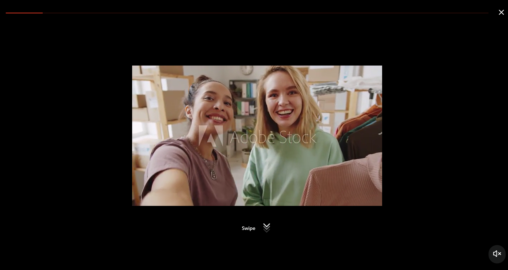

# React Riyils

Instagram/TikTok-style vertical video swiper for React.

[](https://www.npmjs.com/package/react-riyils)
[](https://opensource.org/licenses/MIT)

## Demo

<p align="center">
  
  
</p>

## Features

- Vertical video swiper with Instagram Reels/TikTok-style navigation
- Full-screen viewer with smooth transitions
- Mobile and desktop responsive
- Smart video preloading
- Custom hooks for video control
- TypeScript support
- Customizable colors, sizes, and translations

## Installation

```bash
npm install react-riyils
```

## Usage

```jsx
import React, { useState } from 'react';
import { ReactRiyils, RiyilsViewer } from 'react-riyils';
import 'react-riyils/dist/index.css';

function App() {
  const [currentIndex, setCurrentIndex] = useState(0);
  const [showViewer, setShowViewer] = useState(false);

  const videos = [
    { id: '1', videoUrl: 'https://example.com/video1.mp4' },
    { id: '2', videoUrl: 'https://example.com/video2.mp4' },
    { id: '3', videoUrl: 'https://example.com/video3.mp4' },
  ];

  return (
    <>
      <ReactRiyils
        videos={videos}
        currentIndex={currentIndex}
        onVideoClick={(index) => setShowViewer(true)}
        onVideoChange={setCurrentIndex}
      />

      {showViewer && (
        <RiyilsViewer
          videos={videos}
          initialIndex={currentIndex}
          onClose={() => setShowViewer(false)}
          onVideoChange={setCurrentIndex}
        />
      )}
    </>
  );
}
```

## API

### ReactRiyils Props

| Prop | Type | Default | Description |
|------|------|---------|-------------|
| `videos` | `Video[]` | required | Array of video objects |
| `currentIndex` | `number` | required | Current active video index |
| `onVideoClick` | `(index: number) => void` | required | Click handler |
| `onVideoChange` | `(index: number) => void` | required | Change handler |
| `containerHeightMobile` | `number` | `380` | Mobile height (px) |
| `containerHeightDesktop` | `number` | `500` | Desktop height (px) |
| `progressBarColor` | `string` | `'#3B82F6'` | Progress bar color |
| `videoDurationLimit` | `number` | `10` | Auto-next after seconds |
| `autoPlay` | `boolean` | `true` | Auto-play videos |
| `translations` | `ReactRiyilsTranslations` | optional | Custom UI text translations |

### RiyilsViewer Props

| Prop | Type | Default | Description |
|------|------|---------|-------------|
| `videos` | `Video[]` | required | Array of video objects |
| `initialIndex` | `number` | `0` | Starting video index |
| `onClose` | `() => void` | - | Close handler |
| `onVideoChange` | `(index: number) => void` | - | Change handler |
| `progressBarColor` | `string` | `'#FF0000'` | Progress bar color |
| `translations` | `RiyilsTranslations` | optional | Custom UI text translations |

### Video Type

```typescript
interface Video {
  id: string;
  videoUrl: string;
  thumbnailUrl?: string;
  duration?: number;
}
```

### Translations Usage

You can customize all UI texts by providing the `translations` prop to both components.

#### ReactRiyilsTranslations

```typescript
interface ReactRiyilsTranslations {
  watchFullVideo: string; // Label for the "Watch Full Video" button
  videoProgress: string;  // Label for the video progress indicator
}
```

#### RiyilsTranslations

```typescript
interface RiyilsTranslations {
  swipe: string;                // "Swipe" tip text
  close: string;                // Close button label
  mute: string;                 // Mute label
  unmute: string;               // Unmute label
  speedIndicator: string;       // Speed indicator (e.g., "2x")
  videoViewer: string;          // Dialog title
  videoInteractionArea: string; // Video interaction area label
}
```

#### Example Usage

```jsx
<ReactRiyils
  videos={videos}
  currentIndex={currentIndex}
  onVideoClick={(index) => setShowViewer(true)}
  onVideoChange={setCurrentIndex}
  translations={{
    watchFullVideo: 'Watch the Full Video',
    videoProgress: 'Video progress',
  }}
/>

<RiyilsViewer
  videos={videos}
  initialIndex={currentIndex}
  onClose={() => setShowViewer(false)}
  onVideoChange={setCurrentIndex}
  translations={{
    swipe: 'Swipe',
    close: 'Close',
    mute: 'Mute',
    unmute: 'Unmute',
    speedIndicator: '2x',
    videoViewer: 'Video Viewer',
    videoInteractionArea: 'Video interaction area',
  }}
/>
```

## Lazy Loading / Infinite Scroll

```jsx
import React, { useState, useEffect } from 'react';
import { ReactRiyils, RiyilsViewer } from 'react-riyils';

function App() {
  const [videos, setVideos] = useState([
    { id: '1', videoUrl: 'https://example.com/video1.mp4' },
    { id: '2', videoUrl: 'https://example.com/video2.mp4' },
  ]);
  const [currentIndex, setCurrentIndex] = useState(0);
  const [showViewer, setShowViewer] = useState(false);
  const [isLoading, setIsLoading] = useState(false);
  const [hasMore, setHasMore] = useState(true);
  const [page, setPage] = useState(1);

  const WINDOW_SIZE = 20; // Keep max 20 videos in memory
  const LOAD_THRESHOLD = 3; // Load more when 3 videos away from end

  const loadMoreVideos = async () => {
    if (isLoading || !hasMore) return;
    
    setIsLoading(true);
    try {
      // Replace with your actual API call
      const response = await fetch(`/api/videos?page=${page}&limit=10`);
      const newVideos = await response.json();
      
      if (newVideos.length === 0) {
        setHasMore(false);
      } else {
        setVideos(prev => {
          const updated = [...prev, ...newVideos];
          // Memory management: remove old videos if exceeds window size
          if (updated.length > WINDOW_SIZE) {
            const removeCount = updated.length - WINDOW_SIZE;
            return updated.slice(removeCount);
          }
          return updated;
        });
        setPage(prev => prev + 1);
      }
    } catch (error) {
      console.error('Failed to load videos:', error);
    } finally {
      setIsLoading(false);
    }
  };

  useEffect(() => {
    // Load more videos when approaching the end
    if (currentIndex >= videos.length - LOAD_THRESHOLD && hasMore) {
      loadMoreVideos();
    }
  }, [currentIndex, videos.length, hasMore]);

  return (
    <>
      <ReactRiyils
        videos={videos}
        currentIndex={currentIndex}
        onVideoClick={(index) => setShowViewer(true)}
        onVideoChange={setCurrentIndex}
      />

      {showViewer && (
        <RiyilsViewer
          videos={videos}
          initialIndex={currentIndex}
          onClose={() => setShowViewer(false)}
          onVideoChange={setCurrentIndex}
        />
      )}
    </>
  );
}
```

## Custom Hooks

```typescript
// Video playback control
import { useVideoControls } from 'react-riyils';
const { isPlaying, progress, play, pause, togglePlay, seek } = useVideoControls(videoRef.current, isActive);

// Swiper navigation
import { useSwiperControl } from 'react-riyils';
const { swiperRef, currentIndex, goToSlide, nextSlide, prevSlide } = useSwiperControl(0);

// Video preloading
import { useVideoPreload } from 'react-riyils';
useVideoPreload(videoRefs, activeIndex, preloadDistance);
```

## Keyboard Controls

- **Escape** - Close viewer
- **Space** - Play/Pause
- **M** - Mute/Unmute
- **↑/↓** - Navigate videos

## License

MIT
